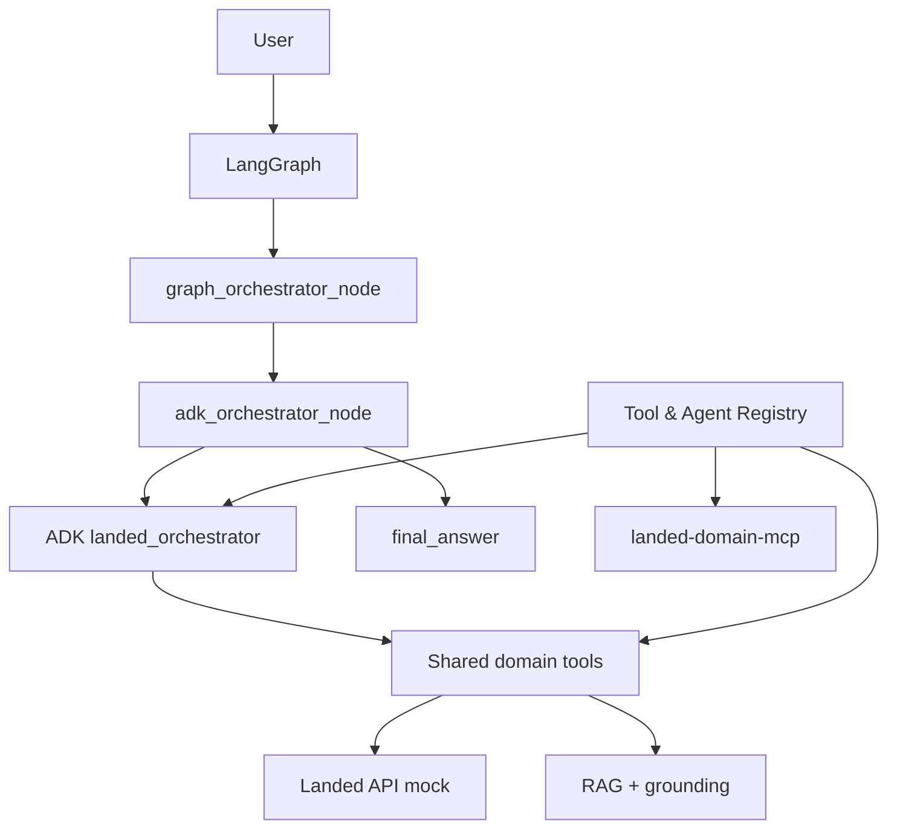

# landed-ai-commerce-platform

AI commerce platform for Landed. It helps Colombian users decide what to buy and whether importing a product is worth it, using multi-agent orchestration, local knowledge retrieval, and grounded recommendations.

## What this repo provides

- **LangGraph workflow runtime** as the primary user entry point.
- **ADK multi-agent runtime** for specialist commerce orchestration inside the graph.
- **Local RAG + grounding** over a unified markdown knowledge base.
- **Shared tools** for product search, pricing, import cost, and knowledge retrieval.
- **MCP server** (`landed-domain-mcp`) to expose the same tools to Cursor and other MCP clients.
- **Local API mock** for product, pricing, and import development without the real Landed backend.
- **Tool & Agent Registry** as the explicit system-level contract for tools, agents, MCP, and future A2A permissions.

## Architecture at a glance



LangGraph coordinates flow and short-term memory. ADK executes specialist agents. They do not compete as two top-level orchestrators.

Visual diagrams: [docs/architecture-diagram.md](docs/architecture-diagram.md)

## Project structure

```text
landed-ai-commerce-platform/
├── packages/
│   ├── agents/              # Google ADK specialist agents
│   │   ├── orchestrator/
│   │   ├── product_search/
│   │   ├── audio_expert/
│   │   ├── pricing/
│   │   ├── import_cost/
│   │   ├── recommendation/
│   │   └── deal_advisor/
│   ├── graphs/              # LangGraph workflow layer
│   │   ├── state.py
│   │   ├── nodes.py
│   │   ├── adk_runner.py
│   │   └── landed_langgraph.py
│   ├── tools/               # Domain tools
│   │   ├── product/
│   │   ├── pricing/
│   │   └── knowledge/
│   ├── knowledge_base/      # Unified markdown corpus
│   │   └── audio/
│   ├── rag/                 # Retrieval + grounding
│   │   ├── retriever.py
│   │   ├── local_retriever.py
│   │   ├── grounding_service.py
│   │   └── embeddings/
│   ├── mcp/                 # MCP exposure layer
│   │   └── landed_mcp_server.py
│   ├── registry/            # Tool & agent registry (system-level layer)
│   │   ├── tool_registry.py
│   │   ├── agent_registry.py
│   │   ├── permissions.py
│   │   └── bootstrap.py
│   └── shared/              # Schemas, config, logging, observability
├── scripts/
│   ├── landed_api_mock.py   # Local Landed API for dev
│   └── run_adk_agent.py     # ADK inspection only
├── .cursor/
│   └── mcp.json             # Cursor MCP config
├── docs/
│   ├── architecture.md
│   ├── architecture-diagram.md
│   ├── roadmap.md
│   └── evaluation.md
├── .env.example
└── requirements.txt
```

## Orchestration layers

### LangGraph (primary entry point)

Entry point: `packages.graphs.landed_langgraph.build_landed_graph`

Default graph (`use_adk=True`):

```text
START -> graph_orchestrator_node -> adk_orchestrator_node -> END
```

| Node | Role |
|------|------|
| `graph_orchestrator_node` | Session state, routing, short-term memory |
| `adk_orchestrator_node` | Invokes ADK `landed_orchestrator` and writes `final_answer` |

Lab graph (`use_adk=False`):

```text
START -> graph_orchestrator_node -> knowledge_node -> recommendation_node -> END
```

| Node | Role |
|------|------|
| `knowledge_node` | Grounding via `retrieve_knowledge` |
| `recommendation_node` | Builds `final_answer` from `grounded_answer` |

Run:

```bash
.venv/bin/python -m packages.graphs.landed_langgraph
```

### ADK (agent execution layer)

Entry point: `packages.agents.orchestrator.root_agent`

| Agent | Responsibility | Tools |
|-------|----------------|-------|
| `landed_orchestrator` | Business orchestration | 6 × `AgentTool` |
| `product_search` | Product resolution and offer search | `search_products`, `get_product_details` |
| `audio_expert` | Technical audio guidance | `retrieve_knowledge` |
| `pricing` | Colombian local price context | `get_local_price` |
| `import_cost` | Landed import cost estimation | `calculate_import_cost` |
| `deal_advisor` | Concrete deal assessment | `get_local_price`, `calculate_import_cost`, `retrieve_knowledge` |
| `recommendation` | Final buying recommendation | `retrieve_knowledge` |

Inspect ADK setup during development:

```bash
.venv/bin/python scripts/run_adk_agent.py
```

Production user traffic should enter through LangGraph, not this script.

### MCP (Cursor and external clients)

Entry point: `packages.mcp.landed_mcp_server`

| MCP tool | Internal tool |
|----------|---------------|
| `retrieve_landed_knowledge` | `retrieve_knowledge` |
| `search_landed_products` | `search_products` |
| `get_landed_product_details` | `get_product_details` |
| `get_landed_local_price` | `get_local_price` |
| `calculate_landed_import_cost` | `calculate_import_cost` |

Run manually:

```bash
.venv/bin/python -m packages.mcp.landed_mcp_server
```

Cursor project config: `.cursor/mcp.json`. Enable `landed-domain-mcp` in Cursor MCP settings.

## System-level registry

Entry point: `packages.registry`

The registry is the explicit source of truth for:

- which tools exist and which agents may use them;
- which MCP tools are exposed and how they map to internal tools;
- which ADK specialists exist and which are planned for A2A exposure;
- bootstrap validation that keeps ADK agents and MCP aligned with the registry.

| Module | Role |
|--------|------|
| `tool_registry.py` | Tool definitions, MCP names, allowed agents |
| `agent_registry.py` | Agent definitions, allowed tools, A2A flags |
| `permissions.py` | `can_agent_use_tool`, `can_mcp_call_tool` |
| `bootstrap.py` | `validate_registry()` against live ADK + MCP code |

Validate the registry:

```bash
.venv/bin/python -c "from packages.registry import assert_registry_is_valid; assert_registry_is_valid(); print('registry ok')"
.venv/bin/pytest tests/test_registry.py -q
```

Planned next system-level layers: authorization, compliance monitoring, API gateway, and event-driven reactivity.

## Local development services

| Service | Port | Purpose |
|---------|------|---------|
| Landed API mock | `3001` | Product, pricing, import tools |
| Ollama | `11434` | Local agent LLM, embeddings, grounding |
| Chroma index | local files | Semantic retrieval |

```bash
# Terminal 1: API mock
.venv/bin/python scripts/landed_api_mock.py

# Terminal 2: Ollama (if using local LLM profile)
ollama serve
```

Set in `.env`:

```bash
LANDED_API_BASE_URL=http://localhost:3001
```

## Knowledge, RAG, and grounding

All local knowledge lives in `packages/knowledge_base/`.

| Layer | Responsibility |
|-------|----------------|
| **RAG** | Retrieve relevant chunks from Chroma or lexical fallback |
| **Grounding** | Answer only from retrieved context, cite sources, refuse when evidence is insufficient |

Flow:

```text
retrieve_knowledge
  -> search_knowledge (Chroma + Ollama embeddings, lexical fallback)
  -> grounding_service (Ollama llama3.1, restrictive prompt)
  -> grounded_answer + sources
```

Index local knowledge:

```bash
ollama serve
ollama pull nomic-embed-text
ollama pull llama3.1

.venv/bin/python -m packages.tools.knowledge.ingest_documents
```

Test grounding directly:

```bash
.venv/bin/python -c "
from packages.tools.knowledge.retrieve_knowledge_tool import retrieve_knowledge
r = retrieve_knowledge('headphones for classical music and gaming')
print(r['data']['grounded_answer'])
"
```

## Configuration

Copy the environment template:

```bash
cp .env.example .env
```

### LLM runtime profiles

Use one codebase for local development and Google Cloud deployment:

| Profile | `LLM_RUNTIME` | Agent models | Notes |
|---------|---------------|--------------|-------|
| **GCP** (default) | `gcp` | `gemini-2.5-flash-lite` | Native ADK + Gemini |
| **Local** | `local` | `llama3.1` | LiteLLM + `ollama_chat/` |

Local profile:

```bash
LLM_RUNTIME=local
ORCHESTRATOR_MODEL=llama3.1
FAST_AGENT_MODEL=llama3.1
REASONING_AGENT_MODEL=llama3.1
OLLAMA_HOST=http://localhost:11434
OLLAMA_GROUNDING_MODEL=llama3.1
```

GCP profile:

```bash
LLM_RUNTIME=gcp
ORCHESTRATOR_MODEL=gemini-2.5-flash-lite
FAST_AGENT_MODEL=gemini-2.5-flash-lite
REASONING_AGENT_MODEL=gemini-2.5-flash-lite
```

## Quick start

```bash
python -m venv .venv
source .venv/bin/activate
pip install -r requirements.txt
cp .env.example .env

# Terminal 1: local Landed API mock
.venv/bin/python scripts/landed_api_mock.py

# Terminal 2: optional local LLM + knowledge index
ollama serve
.venv/bin/python -m packages.tools.knowledge.ingest_documents

# Verify orchestration layers
.venv/bin/python -m packages.graphs.landed_langgraph
.venv/bin/python scripts/run_adk_agent.py

# Optional: verify MCP server module loads
.venv/bin/python -c "import packages.mcp.landed_mcp_server as s; print(s.mcp.name)"
```

Use `build_landed_graph(use_adk=False)` for the grounding-only lab graph.

## Documentation

- [docs/architecture.md](docs/architecture.md) — written architecture reference
- [docs/architecture-diagram.md](docs/architecture-diagram.md) — mermaid diagrams
- [docs/roadmap.md](docs/roadmap.md)
- [docs/evaluation.md](docs/evaluation.md)

## Development guide

- Add or refine agent behavior in `packages/agents/<agent_name>/`.
- Keep agent instructions in each agent's `prompts.py`.
- Add deterministic API calls or calculations in `packages/tools/`.
- Add graph nodes or edges in `packages/graphs/`.
- Bridge LangGraph to ADK in `packages/graphs/adk_runner.py`.
- Update tool/agent permissions in `packages/registry/` when adding capabilities.
- Add markdown knowledge in `packages/knowledge_base/`, then re-run ingest.
- Expose new capabilities through `packages/mcp/landed_mcp_server.py` when needed for external clients.
- Add typed contracts in `packages/shared/schemas/` and transport DTOs in `packages/shared/dto/`.
- Add runtime configuration in `packages/shared/config/`.
- Add domain errors in `packages/shared/errors/`.
- Add trace/log helpers in `packages/shared/logging/` and observability helpers in `packages/shared/observability/`.

The LangGraph layer should own workflow sequencing and short-term memory. The ADK orchestrator should own business delegation to specialist agents. Domain-specific rules should live in the specialist agent or graph node that owns that domain.
