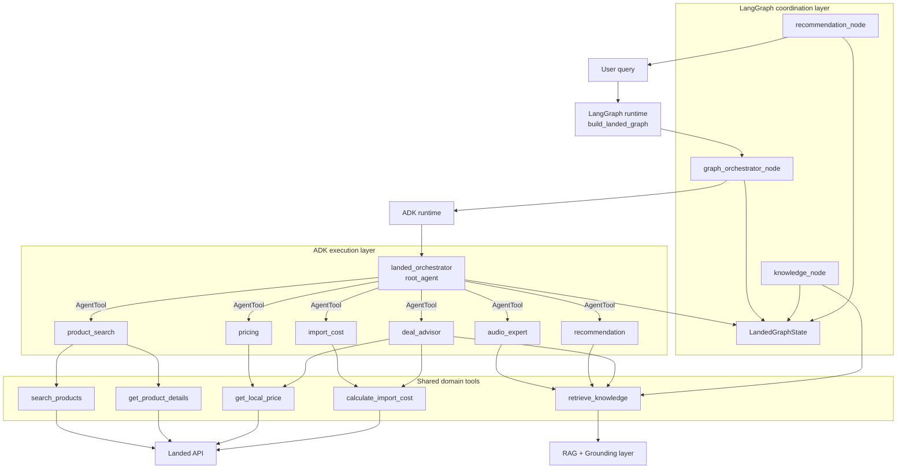
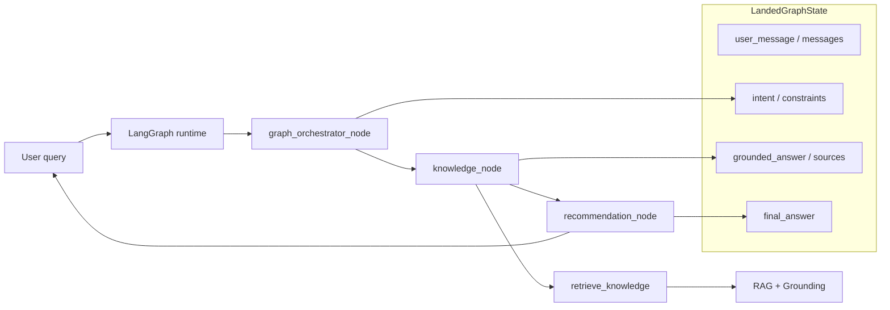
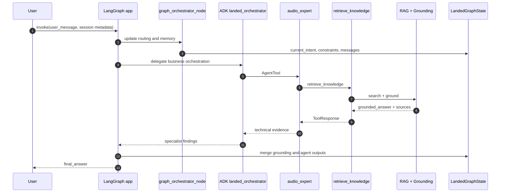
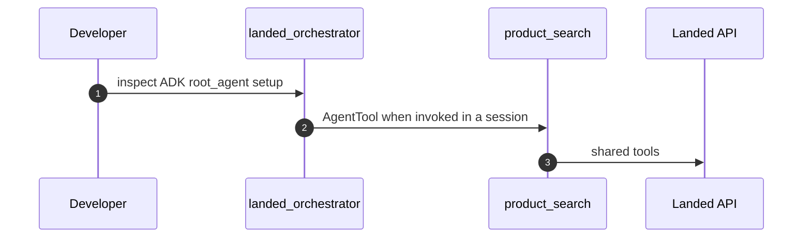
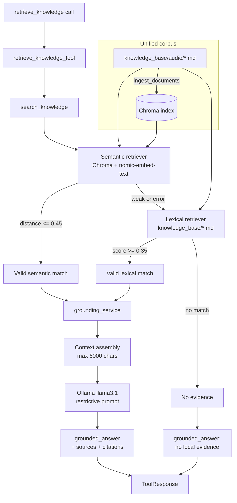
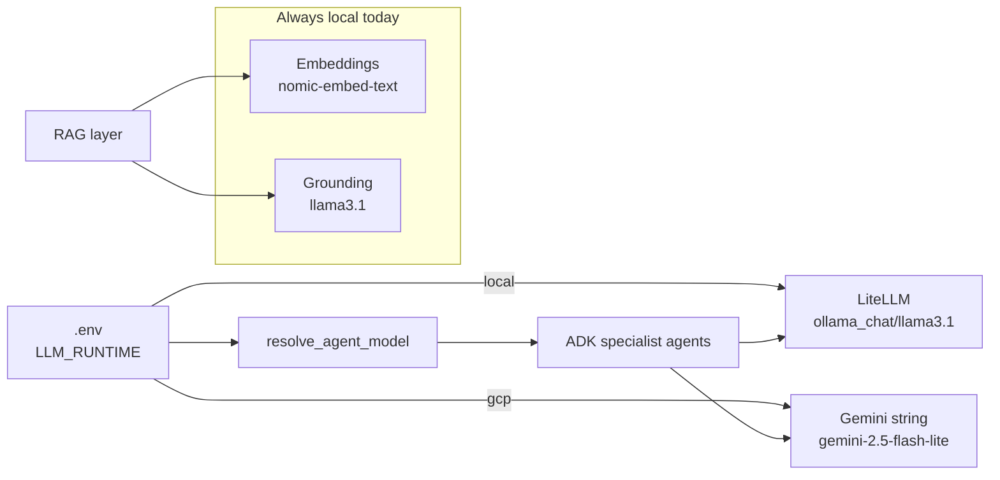
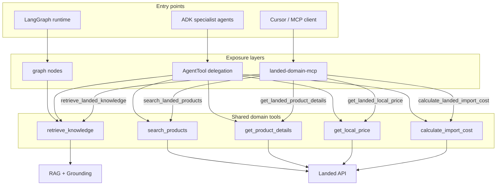
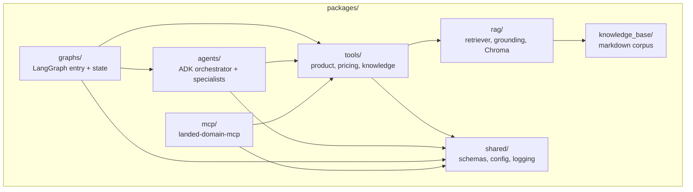

# Architecture Diagrams

Visual reference for the Landed multi-agent commerce platform. These diagrams complement [architecture.md](./architecture.md).

## 1. Target system overview

LangGraph is the user entry point. ADK executes specialist agents inside the graph.

## 2. Current lab graph

The repository currently ships a reduced grounding-first graph while ADK wiring is added incrementally.

## 3. Target end-to-end flow

## 4. ADK-only development flow

`scripts/run_adk_agent.py` is for inspecting the ADK layer directly during development. It is not the production user entry point.

## 5. Knowledge layer: RAG + grounding

### RAG vs grounding

| Stage | Responsibility | Output |
|-------|----------------|--------|
| **RAG** | Retrieve relevant chunks | `sources[]`, `backend` |
| **Grounding** | Constrain answer to sources | `grounded_answer`, citations, refusal |

## 6. LLM runtime profiles

## 7. MCP tool ecosystem

MCP is a fourth entry point into the same shared tools used by LangGraph and ADK.

## 8. Package map

## Related docs

- [architecture.md](./architecture.md) — written architecture reference
- [evaluation.md](./evaluation.md) — evaluation notes
- [roadmap.md](./roadmap.md) — planned improvements
