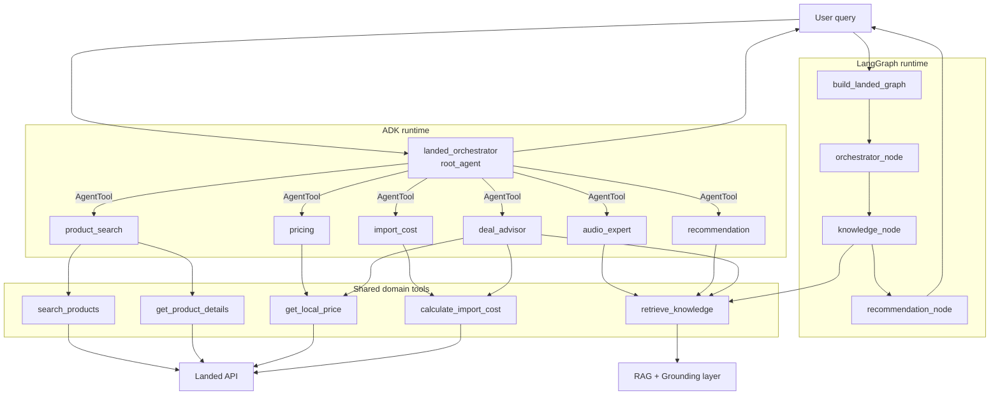
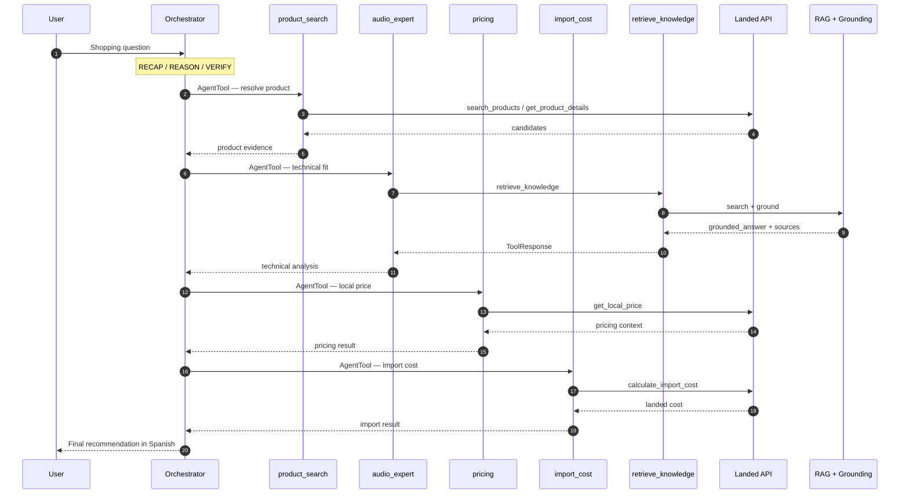
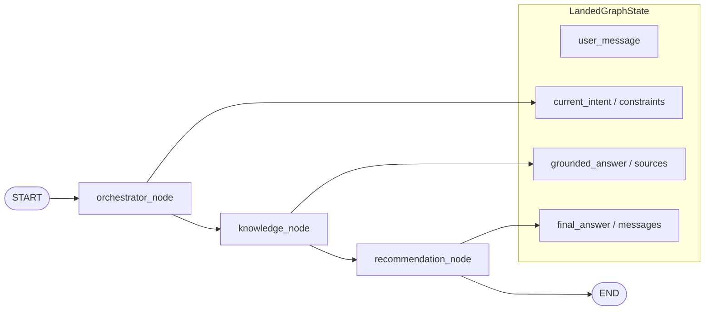
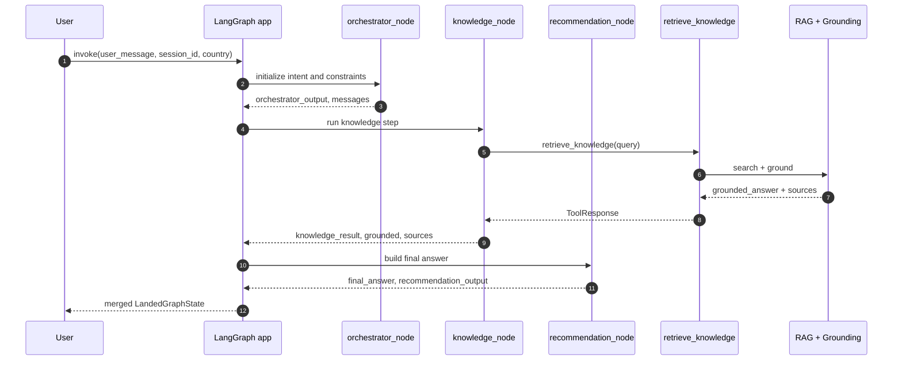
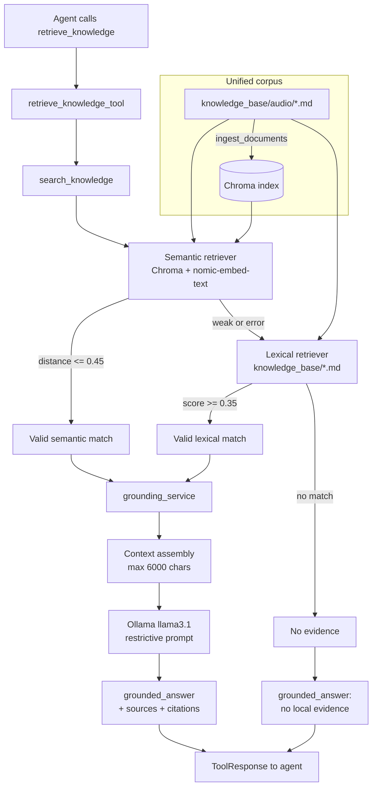
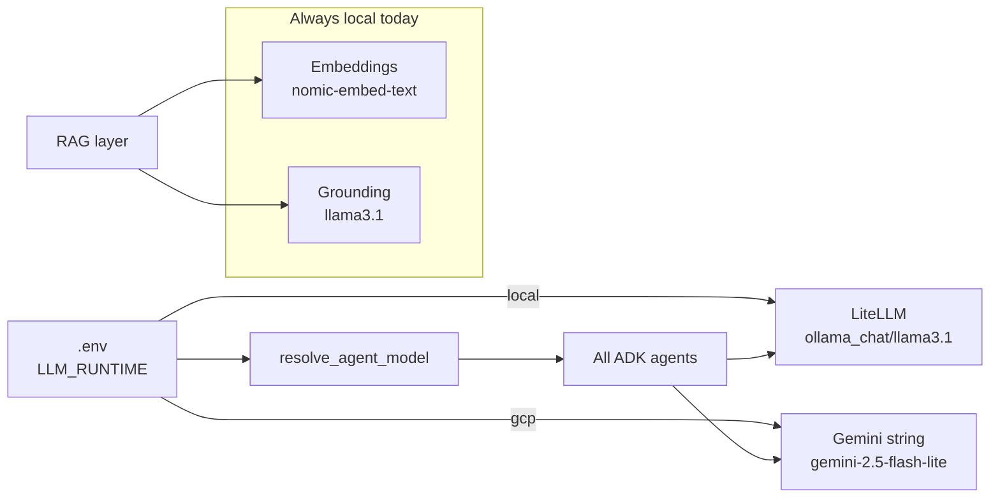
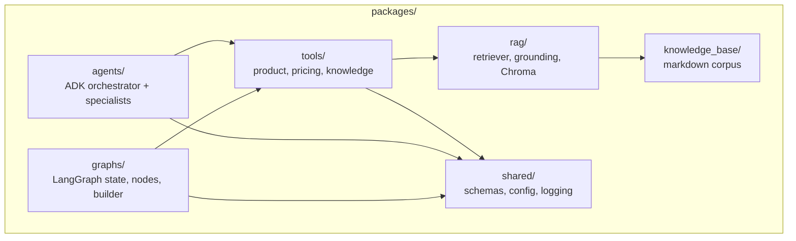

# Architecture Diagrams

Visual reference for the Landed multi-agent commerce platform. These diagrams complement [architecture.md](./architecture.md).

## 1. System overview

Landed exposes two orchestration entry points that share the same tools and knowledge layer.

## 2. End-to-end request flow

Not every request uses all specialists. The orchestrator selects the smallest useful subset per turn.

## 3. LangGraph workflow

Current graph scope is intentionally minimal: grounding-first recommendation. Pricing, import cost, and product search nodes can be added later.

## 4. Knowledge layer: RAG + grounding

### RAG vs grounding

| Stage | Responsibility | Output |
|-------|----------------|--------|
| **RAG** | Retrieve relevant chunks | `sources[]`, `backend` |
| **Grounding** | Constrain answer to sources | `grounded_answer`, citations, refusal |

## 5. LLM runtime profiles

## 6. Package map

## Related docs

- [architecture.md](./architecture.md) — written architecture reference
- [evaluation.md](./evaluation.md) — evaluation notes
- [roadmap.md](./roadmap.md) — planned improvements
