# Architecture Diagrams

Visual reference for the Landed multi-agent commerce platform. These diagrams complement [architecture.md](./architecture.md).

> **Updated:** default LangGraph flow uses `adk_orchestrator_node` + `adk_runner.py`. System-level registry lives in `packages/registry/`.

## 1. Platform layers with registry

Four cooperating layers, three entry points, one shared tool ecosystem, and one cross-cutting registry.

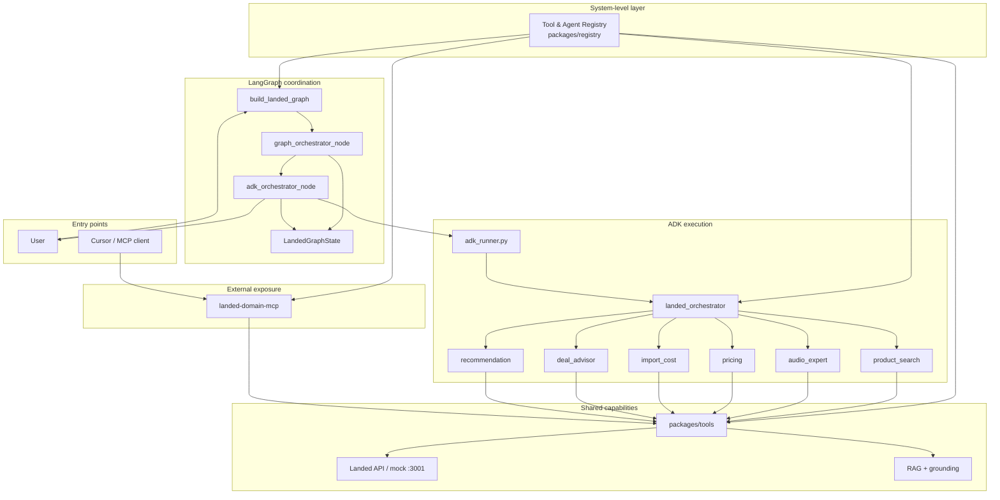

## 2. Default graph (`use_adk=True`)

Production path inside LangGraph.

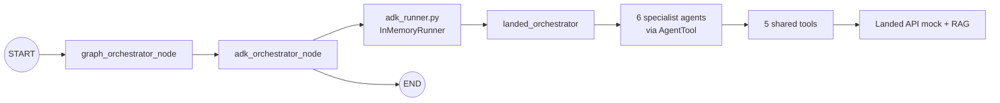

## 3. Lab graph (`use_adk=False`)

Grounding validation without ADK runtime.

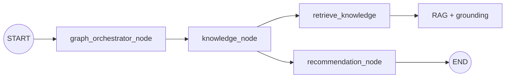

## 4. ADK specialist topology

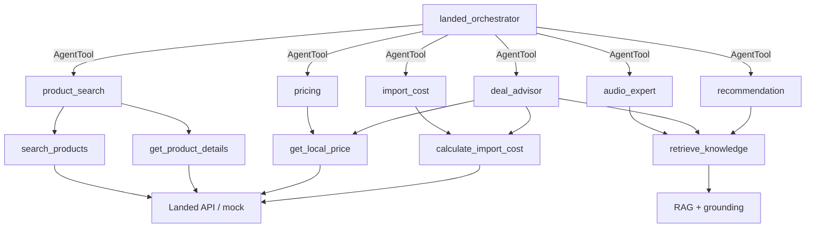

## 5. Default end-to-end sequence

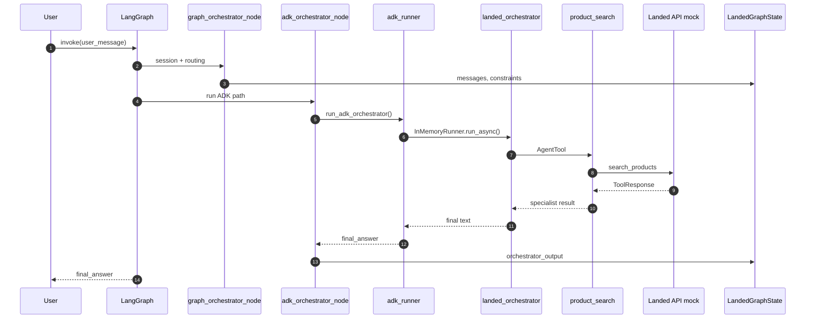

## 6. MCP tool ecosystem

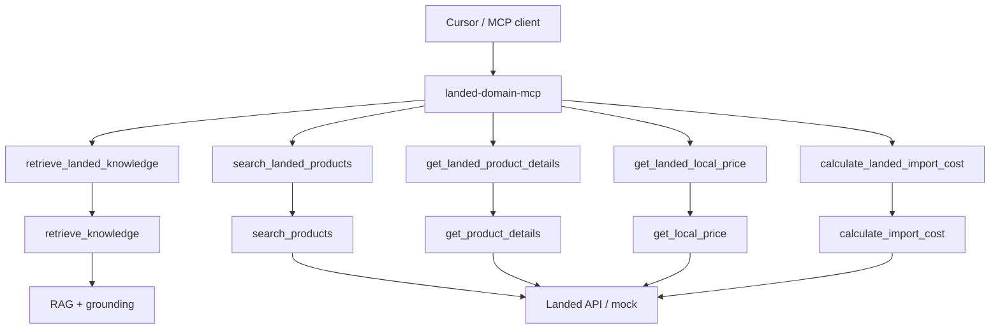

## 7. Local development stack

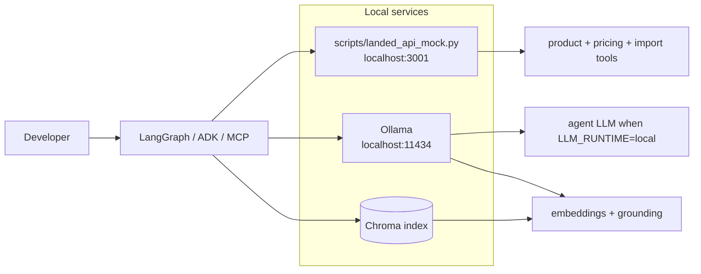

## 8. Knowledge layer: RAG + grounding

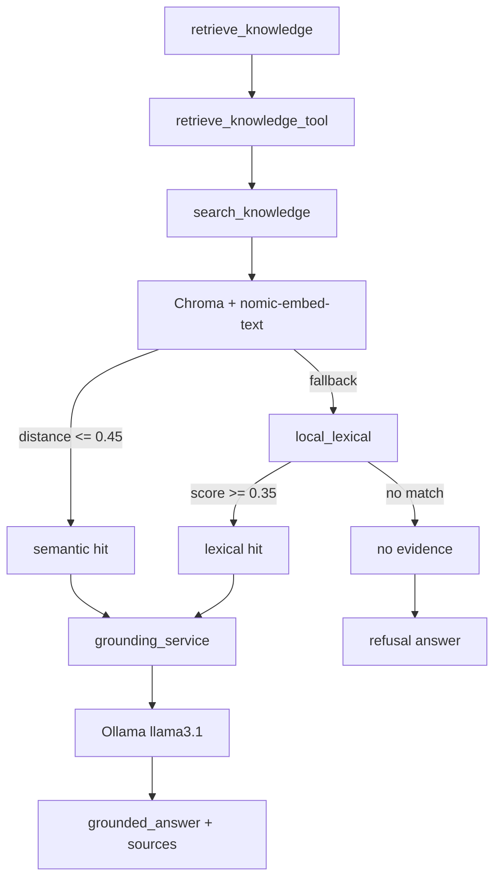

## 9. LLM runtime profiles

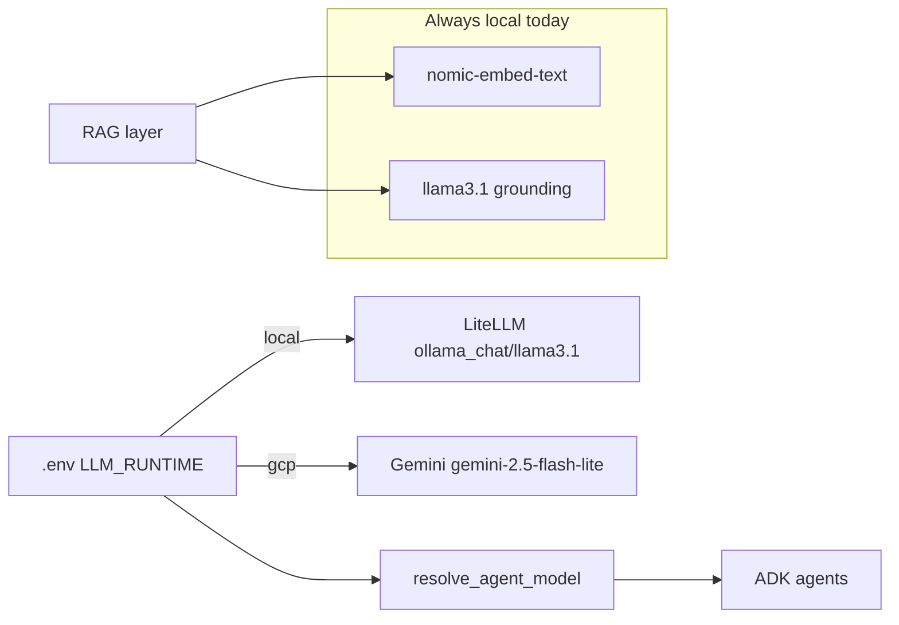

## 10. Package map

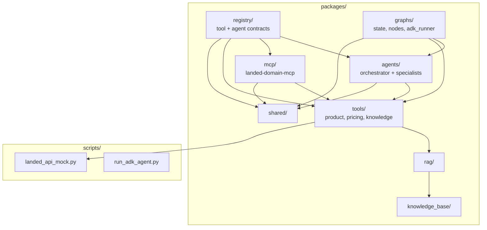

## 11. System-level registry

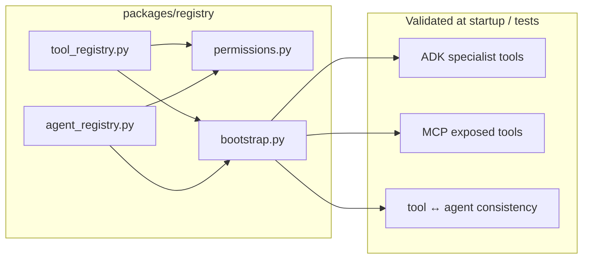

### Registry responsibilities

| Module | Declares |
|--------|----------|
| `tool_registry.py` | tool name, category, MCP name, allowed agents |
| `agent_registry.py` | agent role, runtime, A2A flag, allowed tools |
| `permissions.py` | `can_agent_use_tool`, `can_mcp_call_tool` |
| `bootstrap.py` | drift detection against live ADK and MCP code |

## Related docs

- [architecture.md](./architecture.md) — written architecture reference
- [evaluation.md](./evaluation.md) — evaluation notes
- [roadmap.md](./roadmap.md) — planned improvements
