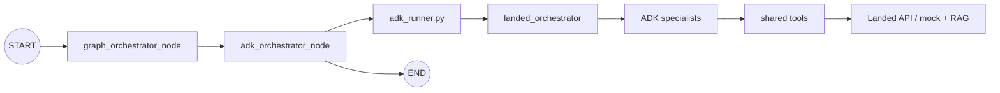
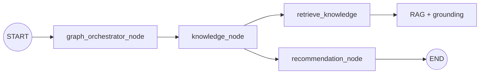
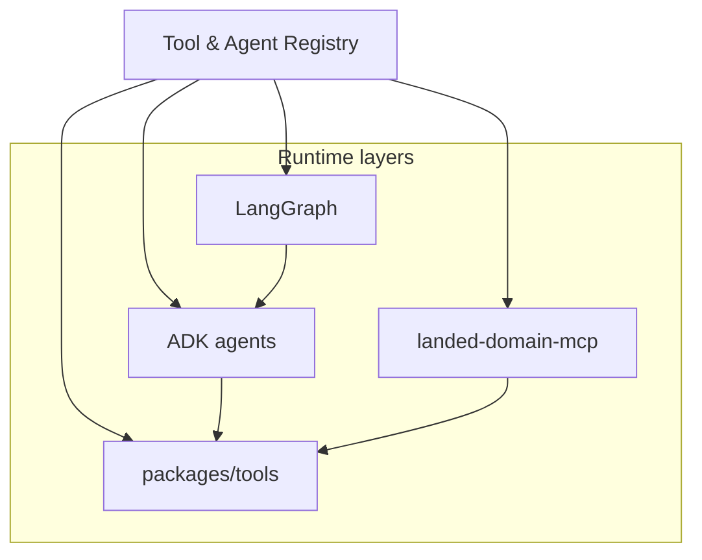
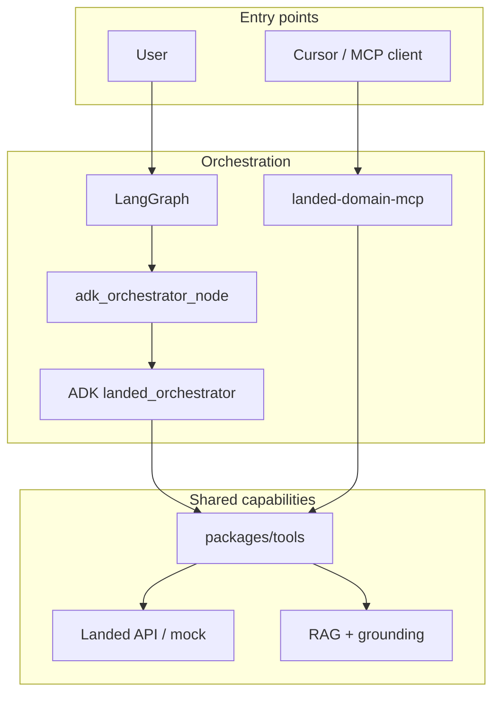
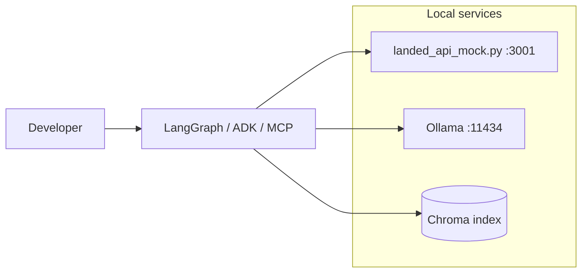

# Architecture

`landed-ai-commerce-platform` is organized as a monorepo for commerce-focused AI agents. The platform uses a layered orchestration model:

- **LangGraph** as the stateful coordination layer: short-term memory, workflow routing, and graph state.
- **Google ADK** as the agent execution layer: multi-agent delegation through specialist agents.
- **Shared tools and RAG** as reusable capabilities underneath both layers.

The user-facing entry point is LangGraph. ADK is not a competing top-level orchestrator; it executes specialist work inside the graph when needed.

For visual flow diagrams, see [architecture-diagram.md](./architecture-diagram.md).

## Packages

- `packages/agents/orchestrator`: entry-point ADK agent that coordinates the commerce workflow, manages fallbacks, and synthesizes the final answer.
- `packages/agents/product_search`: specialist agent focused on product resolution, candidate discovery, and offer search.
- `packages/agents/audio_expert`: specialist agent for audio product analysis, technical fit, and buying guidance.
- `packages/agents/pricing`: specialist agent focused on Colombian local market price context.
- `packages/agents/import_cost`: specialist agent focused on landed import cost analysis.
- `packages/agents/recommendation`: specialist agent focused on final buying recommendations.
- `packages/agents/deal_advisor`: specialist agent that evaluates whether a specific listing, used product, import opportunity, or local offer is worth it.
- `packages/graphs`: LangGraph workflow layer with shared graph state, nodes, and graph builder.
- `packages/tools`: reusable tools grouped by product, pricing, and knowledge domains.
- `packages/knowledge_base`: unified markdown corpus for semantic ingest and lexical fallback.
- `packages/rag`: retriever layer, grounding service, Chroma embeddings storage, and local lexical search.
- `packages/shared`: shared schemas, DTOs, logging, configuration, errors, and observability utilities.
- `packages/mcp`: MCP exposure layer that reuses the same domain tools as ADK and LangGraph.
- `packages/registry`: explicit tool and agent registry with permissions and bootstrap validation.
- `scripts/landed_api_mock.py`: local Landed API mock for product, pricing, and import tool development.

## Multi-Agent Topology

The orchestrator does not call backend or RAG tools directly. It delegates to specialist agents through ADK `AgentTool`.

```text
landed_orchestrator (root_agent)
  -> product_search
  -> audio_expert
  -> pricing
  -> import_cost
  -> deal_advisor
  -> recommendation
```

### Agent responsibilities and tools

| Agent | Role | Tools |
|-------|------|-------|
| `landed_orchestrator` | Supervisor: plan, delegate, synthesize | 6 × `AgentTool` |
| `product_search` | Resolve products and find offers | `search_products`, `get_product_details` |
| `audio_expert` | Technical audio fit and buying guidance | `retrieve_knowledge` |
| `pricing` | Colombian local price context | `get_local_price` |
| `import_cost` | Landed import cost analysis | `calculate_import_cost` |
| `deal_advisor` | Assess a concrete buying opportunity | `get_local_price`, `calculate_import_cost`, `retrieve_knowledge` |
| `recommendation` | Final buying recommendation | `retrieve_knowledge` |

`DealAdvisorAgent` is intentionally a specialist, not a second orchestrator. It should be used when the user asks whether a concrete listing, used product, import opportunity, or local offer is a good deal.

The orchestrator prompt uses the RECAP / REASON / VERIFY loop as an internal reasoning discipline:

- RECAP: identify the user goal, budget, country, constraints, available evidence, and missing data.
- REASON: choose the smallest useful set of specialist agents.
- VERIFY: ensure the recommendation respects constraints, uses available evidence, and clearly states uncertainty.

## LangGraph Workflow Runtime

`packages/graphs` is the primary user entry point. LangGraph wraps ADK instead of competing with it.

### Layered responsibilities

| Layer | Responsibility | Examples |
|-------|----------------|----------|
| **LangGraph** | Stateful coordination, short-term memory, workflow routing | `LandedGraphState`, `graph_orchestrator_node` |
| **ADK** | Specialist agent execution and business orchestration | `landed_orchestrator`, `audio_expert`, `deal_advisor` |
| **Tools** | Deterministic capabilities | `search_products`, `retrieve_knowledge` |
| **RAG / Grounding** | Local evidence | Chroma, lexical fallback, `grounding_service` |
| **MCP** | External tool exposure for Cursor and other clients | `landed-domain-mcp` |

### Default graph

The default graph delegates business orchestration to ADK:



`adk_orchestrator_node` calls `packages/graphs/adk_runner.py`, which invokes ADK `landed_orchestrator` through `InMemoryRunner`. The ADK orchestrator then delegates to specialist agents through `AgentTool` and reaches all shared domain tools.

### Lab graph

A grounding-only lab graph remains available through `build_landed_graph(use_adk=False)`:



Use the lab graph to validate RAG and grounding in isolation without ADK agent runtime cost.

### Package layout

```text
packages/graphs/
├── state.py                 # LandedGraphState TypedDict
├── nodes.py                 # graph_orchestrator, adk_orchestrator, knowledge, recommendation
├── adk_runner.py            # ADK InMemoryRunner bridge for LangGraph
└── landed_langgraph.py      # build_landed_graph(use_adk=True) and local runner
```

### Node responsibilities

| Node | Responsibility | Notes |
|------|----------------|-------|
| `graph_orchestrator_node` | Session state, routing metadata, short-term memory | Not the ADK business orchestrator |
| `adk_orchestrator_node` | Invoke ADK `landed_orchestrator` and persist `final_answer` | Default production path inside LangGraph |
| `knowledge_node` | Call `retrieve_knowledge` and persist grounding outputs | Lab shortcut via `use_adk=False` |
| `recommendation_node` | Build `final_answer` from `grounded_answer` | Lab shortcut via `use_adk=False` |

### Shared graph state

`LandedGraphState` in `packages/graphs/state.py` stores:

- session identity: `session_id`, `user_id`
- conversation memory: `user_message`, `messages`
- task context: `current_intent`, `product_type`, `use_cases`, `budget`, `country`, `constraints`
- grounding outputs: `knowledge_result`, `grounded`, `grounded_answer`, `sources`
- node outputs: `orchestrator_output`, `recommendation_output`, `final_answer`

`user_message` is required at graph entry. Other fields are optional and are populated as nodes execute.

### Local execution

Start the local Landed API mock for product, pricing, and import tools:

```bash
.venv/bin/python scripts/landed_api_mock.py
```

Run the default LangGraph flow (ADK-backed):

```bash
.venv/bin/python -m packages.graphs.landed_langgraph
```

Run the grounding-only lab graph:

```bash
.venv/bin/python -c "
from packages.graphs.landed_langgraph import build_landed_graph
app = build_landed_graph(use_adk=False)
print(app.invoke({'user_message': 'headphones for gaming', 'country': 'Colombia'}).get('final_answer'))
"
```

Direct ADK inspection remains available for development only:

```bash
.venv/bin/python scripts/run_adk_agent.py
```

### LangGraph vs ADK

| Concern | LangGraph | ADK |
|---------|-----------|-----|
| User entry point | Yes | No |
| Short-term memory / graph state | Yes | No |
| Workflow routing | `graph_orchestrator_node` | No |
| Business orchestration | Delegates through `adk_orchestrator_node` | `landed_orchestrator` delegates to specialists |
| Specialist execution | Through `adk_orchestrator_node` | `AgentTool` to specialist agents |
| Shared capabilities | Lab graph calls `retrieve_knowledge` directly | Specialists call all domain tools |

## System-Level Layer: Tool & Agent Registry

`packages/registry` is the first implemented system-level pattern. It makes the Landed tool and agent ecosystem explicit, governable, and testable instead of implicit in imports and hardcoded MCP wrappers.

### Why it exists

Before the registry, the platform already had:

- tools in `packages/tools/*`;
- agents in `packages/agents/*`;
- MCP wrappers in `packages/mcp/landed_mcp_server.py`;
- LangGraph nodes in `packages/graphs/*`.

The registry turns that implicit layout into an explicit contract that future system-level layers can enforce:

- Authentication & Authorization
- API Gateway Enforcement
- Compliance Monitoring
- Event-Driven Reactivity
- A2A exposure and consumption

### Package layout

```text
packages/registry/
├── tool_registry.py      # tool definitions, MCP names, allowed agents
├── agent_registry.py     # agent definitions, allowed tools, A2A flags
├── permissions.py        # can_agent_use_tool, can_mcp_call_tool
└── bootstrap.py          # validate_registry() against live ADK + MCP
```

### Tool registry contract

| Internal tool | MCP tool | Allowed agents |
|---------------|----------|----------------|
| `retrieve_knowledge` | `retrieve_landed_knowledge` | `audio_expert`, `recommendation`, `deal_advisor` |
| `search_products` | `search_landed_products` | `product_search` |
| `get_product_details` | `get_landed_product_details` | `product_search` |
| `get_local_price` | `get_landed_local_price` | `pricing`, `deal_advisor` |
| `calculate_import_cost` | `calculate_landed_import_cost` | `import_cost`, `deal_advisor` |

### Agent registry contract

| Agent | Runtime | A2A-ready | Direct tools |
|-------|---------|-----------|--------------|
| `landed_orchestrator` | ADK | No | delegates via `AgentTool` |
| `product_search` | ADK | Yes | `search_products`, `get_product_details` |
| `audio_expert` | ADK | Yes | `retrieve_knowledge` |
| `pricing` | ADK | Yes | `get_local_price` |
| `import_cost` | ADK | Yes | `calculate_import_cost` |
| `deal_advisor` | ADK | Yes | `get_local_price`, `calculate_import_cost`, `retrieve_knowledge` |
| `recommendation` | ADK | Yes | `retrieve_knowledge` |

### Bootstrap validation

`bootstrap.py` prevents drift between registry and runtime code:

1. tool and agent registries are internally consistent;
2. live ADK specialist agents expose exactly the tools declared in the registry;
3. `landed_orchestrator` delegates to the six expected specialists;
4. MCP exposes exactly the five registry-backed MCP tools.

```bash
.venv/bin/python -c "from packages.registry import assert_registry_is_valid; assert_registry_is_valid()"
.venv/bin/pytest tests/test_registry.py -q
```

### Cross-cutting role



The registry does not execute business logic. It declares what exists, who may use it, and validates that the codebase still matches that declaration.

### Planned system-level extensions

| Pattern | Status | Target package |
|---------|--------|----------------|
| Tool & Agent Registry | Implemented | `packages/registry/` |
| Authentication & Authorization | Planned | `packages/security/` |
| API Gateway Enforcement | Planned | `packages/gateway/` |
| Compliance Monitoring | Planned | `packages/compliance/` |
| Event-Driven Reactivity | Planned | `packages/events/` |

## MCP Exposure Layer

`packages/mcp/landed_mcp_server.py` exposes Landed domain capabilities to external MCP clients such as Cursor, Claude Desktop, or other agent runtimes. The MCP server is a thin adapter: it does not duplicate business logic. Each MCP tool delegates to the same functions used by ADK specialist agents and LangGraph nodes.

### Server

| Property | Value |
|----------|-------|
| Server name | `landed-domain-mcp` |
| Entry point | `python -m packages.mcp.landed_mcp_server` |
| Transport | stdio (FastMCP default) |
| Cursor config | `.cursor/mcp.json` |

### Tool map

| MCP tool | Internal function | Domain |
|----------|-------------------|--------|
| `retrieve_landed_knowledge` | `retrieve_knowledge` | Knowledge + grounding |
| `search_landed_products` | `search_products` | Product search |
| `get_landed_product_details` | `get_product_details` | Product resolution |
| `get_landed_local_price` | `get_local_price` | Colombian local pricing |
| `calculate_landed_import_cost` | `calculate_import_cost` | Landed import cost |

MCP tool names use the `landed_` prefix so external clients can distinguish them from generic tool names. Parameters follow the existing backend contract (`query: str`) rather than alternate signatures such as `product_id` or explicit USD price inputs.

### Tool ecosystem



LangGraph, ADK, and MCP are three entry points into one shared tool ecosystem:

```text
User / developer
  ├─ LangGraph runtime        -> adk_orchestrator_node -> ADK -> shared tools
  ├─ ADK specialist agents    -> AgentTool path -> shared tools
  └─ MCP client               -> landed-domain-mcp -> shared tools
```

This matches the Tool Use / Tool Ecosystem pattern: expose deterministic capabilities once, then let different orchestration layers decide when to call them.

### Configuration and runtime

The MCP process loads environment variables from `.env` through `packages/shared/config/settings.py` when tools are imported. At minimum, local development expects:

- `LANDED_API_BASE_URL` for product, pricing, and import tools
- `OLLAMA_HOST` and `OLLAMA_GROUNDING_MODEL` for knowledge retrieval and grounding

Run manually:

```bash
.venv/bin/python -m packages.mcp.landed_mcp_server
```

In Cursor, enable the server from project settings after `.cursor/mcp.json` is present. Cursor launches the stdio process and discovers the five domain tools automatically.

## Runtime Flow

### Primary flow through LangGraph

1. User invokes the compiled graph with `user_message` and optional session metadata.
2. `graph_orchestrator_node` updates `LandedGraphState`, routing metadata, and short-term memory.
3. `adk_orchestrator_node` invokes ADK `landed_orchestrator` through `run_adk_orchestrator()`.
4. ADK delegates to specialist agents through `AgentTool`.
5. Specialist agents call shared tools against the Landed API and RAG layer.
6. ADK synthesizes specialist findings into a final answer.
7. LangGraph persists `orchestrator_output`, `final_answer`, and updated `messages`.

### Lab flow through LangGraph

When `build_landed_graph(use_adk=False)` is used:

1. `graph_orchestrator_node` initializes session state.
2. `knowledge_node` calls `retrieve_knowledge` directly.
3. `recommendation_node` builds `final_answer` from `grounded_answer`.

### ADK execution inside the graph

When ADK is invoked from LangGraph:

1. `landed_orchestrator` extracts shopping intent, budget, country, constraints, and missing information.
2. It delegates to specialist agents through `AgentTool`.
3. Specialists call domain tools: Landed API for product/pricing/import, `retrieve_knowledge` for local evidence.
4. The ADK orchestrator synthesizes specialist findings for the graph node that requested them.
5. If a dependency fails, the orchestrator continues with partial evidence when safe and clearly states uncertainty.

## LLM Runtime Profiles

The same codebase supports local development and Google Cloud deployment through environment configuration in `packages/shared/config/models.py`.

| Profile | `LLM_RUNTIME` | Agent models | Integration |
|---------|---------------|--------------|-------------|
| **GCP** (default) | `gcp` | `gemini-2.5-flash-lite` | Native ADK + Gemini |
| **Local** | `local` | `llama3.1` (Ollama) | LiteLLM + `ollama_chat/` |

All agents resolve their model through `resolve_agent_model()`. Switch profiles by changing `.env` variables; no code changes are required.

Grounding and RAG embeddings continue to use Ollama locally regardless of the agent runtime profile. A future GCP deployment can migrate embeddings to Vertex AI Vector Search and Gemini embeddings without changing the agent tool contract.

## Knowledge Layer: RAG and Grounding

Landed separates retrieval from grounding.

- **RAG (retrieve):** find relevant context in the knowledge corpus.
- **Grounding (retrieve + constrain + cite + verify):** answer only from that context, cite sources, and refuse when evidence is insufficient.

### Unified knowledge corpus

All markdown knowledge lives in `packages/knowledge_base/`. Both semantic ingest and lexical fallback read from this single source.

```text
packages/knowledge_base/
├── loader.py
└── audio/
    ├── headphones.md
    ├── import_rules.md
    ├── buying_guide.md
    └── ...
```

Semantic index storage lives in `packages/rag/embeddings/chroma/` and is generated by ingest, not committed to git.

### Retrieval flow

```text
retrieve_knowledge(query)
  -> search_knowledge()
       1. Semantic: ChromaDB + Ollama embeddings (nomic-embed-text)
          packages/rag/retriever.py
          Valid matches: L2 distance <= 0.45
          backend: chroma_ollama

       2. Fallback: lexical search over the same markdown corpus
          packages/rag/local_retriever.py
          Valid matches: score >= 0.35 with stop-word filtering
          backend: local_lexical
```

### Grounding flow

```text
retrieve_knowledge(query)
  -> answer_with_local_grounding()
       packages/rag/grounding_service.py

       If no valid sources:
         - grounded: false
         - grounded_answer: explicit "no local evidence" message
         - synthesis_available: false

       If valid sources:
         - assemble context (max 6000 chars)
         - call Ollama chat (llama3.1) with restrictive prompt
           packages/rag/prompts.py
         - return grounded_answer with answer, reasoning, gaps, and sources
```

### Agent-facing knowledge contract

`retrieve_knowledge` returns a normalized `ToolResponse` with:

- `sources`: retrieved chunks with metadata, distance, or lexical score
- `grounded`: whether retrieval found sufficient local evidence
- `grounded_answer`: constrained synthesis from the grounding service
- `grounding_model`: Ollama model used for synthesis
- `synthesis_available`: whether grounding LLM synthesis succeeded
- `backend`: `chroma_ollama`, `local_lexical`, or `unavailable`

Specialist agents (`audio_expert`, `recommendation`, `deal_advisor`) treat `grounded_answer` as primary evidence and use `sources` only for verification or gaps. If `grounded` is false, they must not invent technical or buying claims.

## Local Development Stack

Local development typically runs three supporting services alongside the agent platform:



| Service | Purpose | Command |
|---------|---------|---------|
| **Landed API mock** | Product search, pricing, import cost tools | `python scripts/landed_api_mock.py` |
| **Ollama** | Agent LLM (local profile), embeddings, grounding | `ollama serve` |
| **Chroma index** | Semantic retrieval over `knowledge_base/` | `python -m packages.tools.knowledge.ingest_documents` |

`scripts/landed_api_mock.py` implements the endpoints used by the shared tools:

- `GET /search?q=`
- `GET /products/resolve/preview?q=` or `title=`
- `GET /compare?q=` or `query=`

Point `LANDED_API_BASE_URL` to the mock (`http://localhost:3001`) or to the real Landed backend when available.

## External Dependencies

- Landed backend API, configured through `LANDED_API_BASE_URL`.
- Google ADK for conversational multi-agent orchestration.
- LangGraph for deterministic workflow orchestration in `packages/graphs`.
- Ollama for local embeddings, grounding synthesis, and optional local agent runtime.
- ChromaDB for local vector storage.
- LiteLLM for Ollama integration when `LLM_RUNTIME=local`.
- Gemini when `LLM_RUNTIME=gcp`.
- MCP SDK (`mcp` + FastMCP) for external tool exposure through `packages/mcp`.

## Data Contracts

The first shared contracts live in `packages/shared/schemas/commerce.py`:

- `UserShoppingIntent`
- `ProductCandidate`
- `TechnicalAnalysis`
- `PricingResult`
- `ImportCostResult`
- `DealAssessmentResult`
- `EvidenceSource`
- `AgentConfidence`
- `RecommendationResult`

Domain-specific schema modules provide narrower contracts for agent work:

- `product_search_schema.py`
- `pricing_schema.py`
- `recommendation_schema.py`
- `agent_response_schema.py`

The lightweight agent transport DTOs live in `packages/shared/dto/agent_io.py`:

- `AgentTask`
- `AgentResult`

These contracts are intentionally small. They give each agent a stable vocabulary without forcing a full workflow engine too early.

## Fault Tolerance

Tools return a normalized response envelope with:

- `ok`: whether the operation completed successfully.
- `trace_id`: correlation identifier for debugging and observability.
- `source`: origin of the evidence.
- `data`: successful payload.
- `error`: normalized failure payload.

The API client includes configurable timeout, retry count, and exponential backoff.

The orchestrator is instructed to continue with partial evidence when pricing, import cost, product search, or knowledge retrieval are unavailable, as long as the answer remains safe and useful. When evidence is incomplete, the final recommendation must clearly state the uncertainty instead of pretending full confidence.

Knowledge retrieval has layered fallbacks:

1. Semantic search through Chroma + Ollama embeddings.
2. Lexical search over the same markdown corpus.
3. Explicit no-evidence response from the grounding service when retrieval finds nothing useful.

If grounding synthesis fails but sources exist, the tool still returns `sources` with `synthesis_available: false`.

## Observability

Every agent and tool interaction should be traceable through a shared `trace_id`.

The platform should log:

- user intent extraction;
- selected agents or tools;
- tool inputs and outputs;
- fallback decisions;
- failed dependencies;
- final recommendation;
- confidence and uncertainty notes.

This supports debugging, auditability, evaluation, and future optimization of the agentic workflow.

## Future Evolution

Near-term improvements that fit the current architecture:

- Migrate semantic retrieval from Chroma + Ollama to Vertex AI Vector Search + Gemini embeddings in GCP.
- Add evaluation harnesses for grounded answers and out-of-domain refusal behavior.
- Expand `packages/knowledge_base/` beyond audio as new commerce categories are added.
- Add richer LangGraph routing for explicit pricing/import/product branches before ADK delegation.
- Implement remaining system-level patterns on top of `packages/registry/`: authorization, compliance, gateway, and events.

## Architecture Principle

Landed should avoid creating agents just for structural complexity. A new specialist agent should be introduced only when a capability has enough independent logic, tools, evaluation criteria, or failure behavior to justify being isolated.

The current target is a pragmatic multi-agent commerce platform: simple enough to debug, modular enough to evolve, and reliable enough to produce useful buying recommendations for users.
